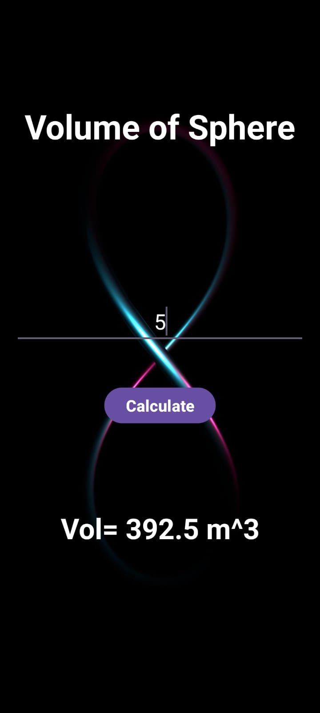
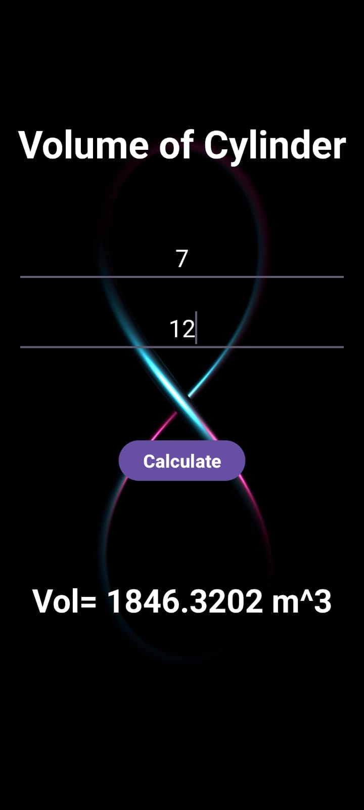

# VolumeCalculatorApp 📏🔢

VolumeCalculatorApp is an Android project designed to practice the concepts of Adapters and GridView. The main screen features a GridView displaying four shapes: Sphere, Cylinder, Cube, and Prism. Each grid item includes an image of the shape and its name. When a shape is clicked, a new screen appears where you can enter the required dimensions and calculate the volume of the shape. This app uses multiple intents to navigate to different activities for each shape's volume calculation.

## Features
- **Main Screen:**
  - GridView displaying four shapes: Sphere, Cylinder, Cube, and Prism.
  - Each grid item contains:
    - An ImageView for the shape image.
    - A TextView for the shape name.
- **Shape Calculation Screen:**
  - Input fields for the required dimensions of the selected shape.
  - Calculate button to display the volume of the shape.

## Technologies Used
- Java
- Android Studio
- GridView
- Custom Adapter
- Intents for activity navigation

## Screenshots
- **Main Screen:**

  
  

- **Shape Calculation Screen:**

  
  

## How to Run
1. Clone the repository: `git clone https://github.com/yourusername/VolumeCalculatorApp.git`
2. Open in Android Studio
3. Build and run on an emulator or physical device

## Connect with Me
- [Twitter](https://x.com/kaifali744)
- [LinkedIn](https://www.linkedin.com/in/mohammad-kaif-ali-3a19671a0)

